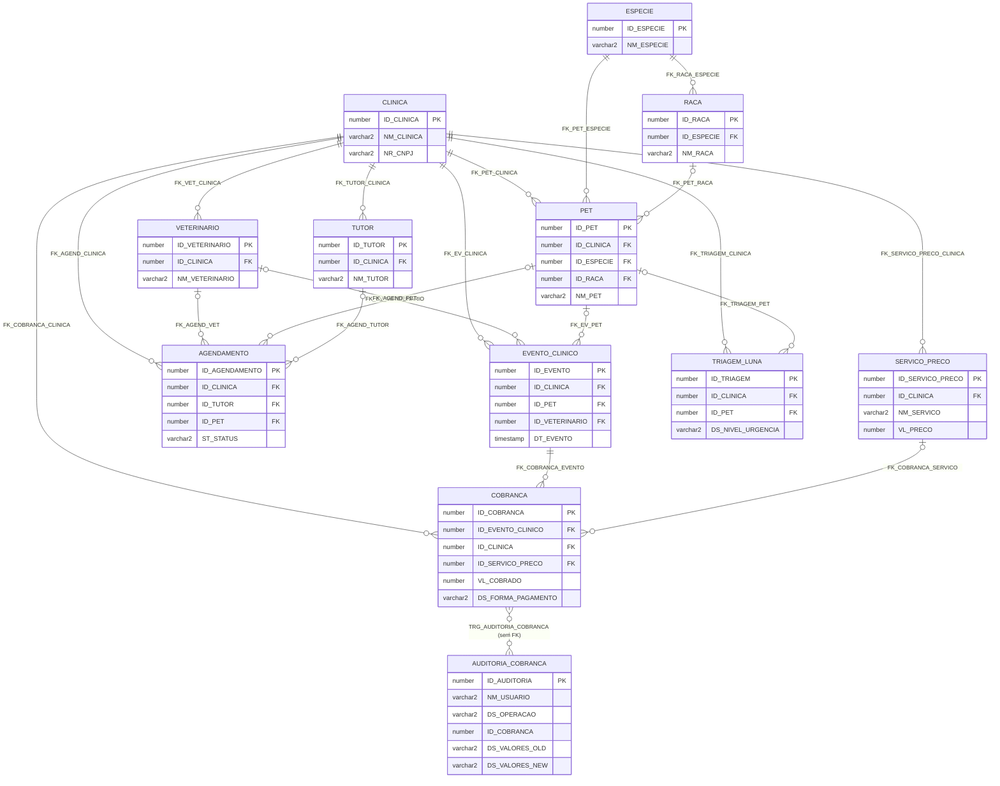

-555)

## Kura · Banco de Dados Oracle

KURA é um sistema de gestão de continuidade veterinária desenvolvido para a **Clyvo Vet** como parte do Challenge FIAP 2026. O banco Oracle 19c opera no padrão **Shared Database**, servindo simultaneamente dois backends independentes: o **Backend Clínica** (.NET, responsável pelo prontuário eletrônico, IoT e IA) e o **Backend Tutor** (Java, responsável por identidade, agendamentos e conformidade LGPD). Regras estritas de *ownership* de escrita por domínio evitam concorrência descontrolada, enquanto leitura cruzada entre serviços é permitida via views e entidades `@Immutable`. O schema foi projetado em 3ª Forma Normal (3FN), com constraints nomeadas, sequences Oracle e suporte nativo a `GenerationType.IDENTITY` do Hibernate 6.

### Sobre o arquivo de entrega

O schema real do KURA é mantido por **19 migrations Flyway** no repositório `backend-tutor-java`. O arquivo **`src/banco_kura_final.sql`** é a **consolidação dessas 19 migrations num único script executável**: cada tabela já nasce no estado final (estado da migration **V19**), com todas as ~75 alterações posteriores (`ALTER TABLE`) já aplicadas inline — **mais** os objetos PL/SQL e a tabela de auditoria exigidos pela Sprint 3.

O script é **re-executável**: o BLOCO 1 (limpeza idempotente) derruba, **por nome**, apenas os objetos do KURA — nunca um `DROP` genérico —, porque o schema de aluno da FIAP é **compartilhado entre várias disciplinas**. Nenhuma credencial, host ou connection string aparece no arquivo; toda a carga do BLOCO 7 é fictícia e declarada como tal.

---

## Sumário

- [Arquitetura](#arquitetura)
  - [Domínios e Propriedade das Tabelas](#domínios-e-propriedade-das-tabelas)
  - [Estratégia de Chave Primária](#estratégia-de-chave-primária)
- [Estrutura do Schema](#estrutura-do-schema)
  - [Blocos do arquivo](#blocos-do-arquivo)
  - [Tabelas (30)](#tabelas-30)
  - [Sequences (29 + 1)](#sequences-29--1)
  - [Índices (13 + 2)](#índices-13--2)
  - [Views (2)](#views-2)
- [Objetos PL/SQL da Sprint 3](#objetos-plsql-da-sprint-3)
  - [Função 1 — `FN_COBRANCA_JSON`](#função-1--fn_cobranca_json)
  - [Função 2 — `FN_CALCULAR_SCORE_URGENCIA`](#função-2--fn_calcular_score_urgencia)
  - [Procedimento 1 — `PRC_LISTAR_COBRANCAS_JSON`](#procedimento-1--prc_listar_cobrancas_json)
  - [Procedimento 2 — `PRC_RELATORIO_COBRANCAS`](#procedimento-2--prc_relatorio_cobrancas)
  - [Gatilho — `TRG_AUDITORIA_COBRANCA` + `AUDITORIA_COBRANCA`](#gatilho--trg_auditoria_cobranca--auditoria_cobranca)
- [Modelo de Tratamento de Erros](#modelo-de-tratamento-de-erros)
- [Pré-requisitos](#pré-requisitos)
- [Como Executar](#como-executar)
- [Re-execução e Limpeza](#re-execução-e-limpeza)
- [Diagrama Entidade-Relacionamento](#diagrama-entidade-relacionamento)
- [Variáveis de Ambiente / Conexão](#variáveis-de-ambiente--conexão)
- [Documentação](#documentação)
- [Equipe](#equipe)
- [Licença](#licença)

---

## Arquitetura

### Domínios e Propriedade das Tabelas

| Domínio | Tabelas |
|---------|---------|
| **.NET (Backend Clínica)** | `CLINICA`, `ESPECIE`, `TIPO_EVENTO`, `MEDICAMENTO`, `RACA`, `VETERINARIO`, `TUTOR`, `DISPOSITIVO_IOT`, `SERVICO_PRECO`, `PET`, `INVITE_TUTOR`, `USUARIO_CLINICA`, `LEITURA_TEMPERATURA`, `INTERACAO_CANAL`, `NOTIFICACAO`, `TUTOR_PET`, `EVENTO_CLINICO`, `ALERTA_TEMPERATURA`, `TRIAGEM_LUNA`, `CONSULTA`, `EXAME`, `VACINA`, `PRESCRICAO`, `DOCUMENTO`, `COBRANCA` |
| **Java (Backend Tutor)** | `CONTA_TUTOR`, `CONSENTIMENTO`, `IDEMPOTENCY_KEY` |
| **Shared-write** | `AGENDAMENTO` (Java cria/edita/cancela; .NET atualiza `ST_STATUS`) |
| **Auditoria (compartilhada)** | `LOG_ERRO`, `AUDITORIA_COBRANCA` *(objeto acadêmico da Sprint 3 — não vira migration Flyway)* |

**Leitura cruzada:**
- .NET lê `CONTA_TUTOR`, `CONSENTIMENTO`, `AGENDAMENTO`
- Java lê `INVITE_TUTOR`, `TUTOR`, `PET`, `VETERINARIO`, `CLINICA`, `ESPECIE`, `RACA` via entidades `@Immutable`

A tabela `AGENDAMENTO` é **shared-write**: Java cria, edita e cancela; .NET atualiza `ST_STATUS` via PATCH. O campo `NR_VERSION` implementa Optimistic Locking (`@Version` do JPA/Hibernate) — conflito de versão resulta em `ORA-00001` tratado como HTTP 409.

### Estratégia de Chave Primária

O schema adota — **fiel ao banco real, sem uniformização** — duas estratégias de PK diferenciadas por domínio:

| Estratégia | Nº de tabelas | Tabelas | Motivo |
|-----------|:---:|---------|--------|
| `DEFAULT SEQ_xxx.NEXTVAL` | 26 | Todas as tabelas .NET-owned | Sequências Oracle geradas no lado do banco (migration V12). Sintaxe `DEFAULT SEQ.NEXTVAL` exige Oracle 12c+ |
| `GENERATED BY DEFAULT AS IDENTITY` | 4 | `CONTA_TUTOR`, `CONSENTIMENTO`, `IDEMPOTENCY_KEY`, `AGENDAMENTO` | Padrão Java-owned. `AGENDAMENTO` é `IDENTITY` no banco **e** puxa de `SEQ_AGENDAMENTO` pela entidade JPA (`GenerationType.SEQUENCE`) — as duas coisas coexistem porque `GENERATED BY DEFAULT` (≠ `GENERATED ALWAYS`) aceita valor explícito |

> `TUTOR_PET` tem PK composta `(ID_TUTOR, ID_PET)` — sem sequence.

---

## Estrutura do Schema

### Blocos do arquivo

| Bloco | Conteúdo |
|:---:|---|
| 0 | Cabeçalho e configuração de sessão (`SET SERVEROUTPUT ON SIZE UNLIMITED`, `SET DEFINE OFF`, `LINESIZE 400`…) |
| 1 | Limpeza idempotente — `DROP` dos objetos KURA, **por nome** |
| 2 | **29 sequences** (`START WITH 100 INCREMENT BY 1`) |
| 3 | **30 tabelas** (estado V19), em ordem topológica de dependência de FK (5 níveis) |
| 4 | **13 índices** explícitos (além dos de PK/UNIQUE) |
| 5 | **2 views** |
| 6 | Tabela de auditoria da Sprint 3 — `AUDITORIA_COBRANCA` + `SEQ_AUDITORIA_COBRANCA` + 2 índices |
| 7 | Carga de dados — **≥ 5 registros por tabela**, fictícios |
| 8 | **Funções** — `FN_COBRANCA_JSON`, `FN_CALCULAR_SCORE_URGENCIA` |
| 9 | **Procedimentos** — `PRC_LISTAR_COBRANCAS_JSON`, `PRC_RELATORIO_COBRANCAS` |
| 10 | **Trigger** — `TRG_AUDITORIA_COBRANCA` |
| 11 | Bloco de demonstração — caminho feliz + cada exceção tratada |

### Tabelas (30)

Ordenadas por nível de dependência de FK (ordem de criação no BLOCO 3).

| # | Tabela | PK | Domínio | Descrição |
|:--:|--------|----|---------|-----------|
| 1 | `CLINICA` | `ID_CLINICA` (SEQ) | .NET | Clínicas veterinárias. Raiz do isolamento multi-tenant. |
| 1 | `ESPECIE` | `ID_ESPECIE` (SEQ) | .NET | Espécies animais (Cão, Gato…). Catálogo de baixa mutabilidade. |
| 1 | `TIPO_EVENTO` | `ID_TIPO_EVENTO` (SEQ) | .NET | Catálogo de tipos de evento clínico. `CD_TIPO` = chave de negócio. |
| 1 | `MEDICAMENTO` | `ID_MEDICAMENTO` (SEQ) | .NET | Catálogo central de medicamentos para prescrições. |
| 1 | `LOG_ERRO` | `ID_LOG` (SEQ) | Auditoria | Log de erros de procedures Oracle. Sem FKs intencionalmente. |
| 1 | `IDEMPOTENCY_KEY` | `ID_IDEMPOTENCY` (IDENTITY) | Java | Garantia exactly-once para POSTs sensíveis. TTL 24h. |
| 2 | `RACA` | `ID_RACA` (SEQ) | .NET | Raças por espécie. |
| 2 | `VETERINARIO` | `ID_VETERINARIO` (SEQ) | .NET | Veterinários vinculados à clínica. `UK_VET_CLINICA_ID` (V19) sustenta a FK composta anti cross-tenant de `USUARIO_CLINICA`. |
| 2 | `TUTOR` | `ID_TUTOR` (SEQ) | .NET | Responsável pelo pet. Java lê via `@Immutable`. |
| 2 | `DISPOSITIVO_IOT` | `ID_DISPOSITIVO` (SEQ) | .NET | Sensores IoT de temperatura por clínica. |
| 2 | `SERVICO_PRECO` | `ID_SERVICO_PRECO` (SEQ) | .NET | Catálogo de preços da clínica (migration V18). Alterar `VL_PRECO` não reescreve cobrança já lançada. |
| 3 | `PET` | `ID_PET` (SEQ) | .NET | Animal atendido. `ID_PET` = prontuário único do paciente. |
| 3 | `INVITE_TUTOR` | `ID_INVITE` (SEQ) | .NET | Convite gerado pelo .NET, consumido 1× pelo Java. |
| 3 | `CONSENTIMENTO` | `ID_CONSENTIMENTO` (IDENTITY) | Java | Histórico LGPD art. 7º, I. Somente INSERT — nunca UPDATE. |
| 3 | `USUARIO_CLINICA` | `ID_USUARIO_CLINICA` (SEQ) | .NET | Identidade individual do lado clínico (migration V17). FK composta com `VETERINARIO` recusa vet de outra clínica. |
| 3 | `LEITURA_TEMPERATURA` | `ID_LEITURA` (SEQ) | .NET | Séries temporais de temperatura/umidade por dispositivo IoT. |
| 3 | `INTERACAO_CANAL` | `ID_INTERACAO_CANAL` (SEQ) | .NET | Interação de canal registrada pela Luna (migration V15). `ID_CLINICA` nullable = origem não identificada. |
| 3 | `NOTIFICACAO` | `ID_NOTIFICACAO` (SEQ) | .NET | Notificações internas da clínica (tutor e/ou veterinário). |
| 4 | `TUTOR_PET` | `(ID_TUTOR, ID_PET)` | .NET | Vínculo N:N tutores ↔ pets. `ST_PRINCIPAL='S'` = quem recebe notificações. |
| 4 | `CONTA_TUTOR` | `ID_CONTA` (IDENTITY) | Java | Credenciais de acesso ao portal do tutor. Criada no fluxo `register-invite`. |
| 4 | `EVENTO_CLINICO` | `ID_EVENTO` (SEQ) | .NET | Núcleo da timeline clínica. Entidade completa desde a V9. |
| 4 | `ALERTA_TEMPERATURA` | `ID_ALERTA` (SEQ) | .NET | Alertas por leitura IoT fora da faixa. |
| 4 | `TRIAGEM_LUNA` | `ID_TRIAGEM` (SEQ) | .NET | Triagens da IA Luna. `DS_NIVEL_URGENCIA` é o destino da `FN_CALCULAR_SCORE_URGENCIA`. |
| 5 | `AGENDAMENTO` | `ID_AGENDAMENTO` (IDENTITY + SEQ) | Java / Shared | Shared-write. `NR_VERSION` = optimistic locking (409). |
| 5 | `CONSULTA` | `ID_CONSULTA` (SEQ) | .NET | Detalhe de consulta. Relação 1:1 com `EVENTO_CLINICO`. |
| 5 | `EXAME` | `ID_EXAME` (SEQ) | .NET | Resultado de exame vinculado a um evento clínico. |
| 5 | `VACINA` | `ID_VACINA` (SEQ) | .NET | Aplicação de vacina vinculada a um evento clínico. |
| 5 | `PRESCRICAO` | `ID_PRESCRICAO` (SEQ) | .NET | Prescrição de medicamento vinculada a um evento clínico. |
| 5 | `DOCUMENTO` | `ID_DOCUMENTO` (SEQ) | .NET | Metadados de documento (PDF, imagem) vinculado a um evento. |
| 5 | `COBRANCA` | `ID_COBRANCA` (SEQ) | .NET | Lançamento financeiro (migration V18). **Tabela de fatos da Sprint 3.** `VL_COBRADO` é `NUMBER(10,2)` — cópia do valor no lançamento. |

**Tabela de auditoria da Sprint 3 (BLOCO 6 — não é migration Flyway):**

| Tabela | PK | Descrição |
|--------|----|-----------|
| `AUDITORIA_COBRANCA` | `ID_AUDITORIA` (SEQ) | Trilha de auditoria DML de `COBRANCA`. Preenchida exclusivamente por `TRG_AUDITORIA_COBRANCA`. Sem FK para `COBRANCA` (auditar `DELETE` com FK ativa seria autocontraditório). |

### Sequences (29 + 1)

Todas criadas com `START WITH 100 INCREMENT BY 1` — convenção herdada das migrations V1/V12: fica acima do maior ID dos seeds de desenvolvimento e das linhas de produção.

| Grupo | Sequences |
|-------|-----------|
| .NET-owned (tabelas V1, migration V12) | `SEQ_CLINICA`, `SEQ_ESPECIE`, `SEQ_TIPO_EVENTO`, `SEQ_RACA`, `SEQ_VETERINARIO`, `SEQ_TUTOR`, `SEQ_PET`, `SEQ_INVITE_TUTOR`, `SEQ_EVENTO_CLINICO` |
| .NET-owned (tabelas V9, migration V12) | `SEQ_MEDICAMENTO`, `SEQ_NOTIFICACAO`, `SEQ_DISPOSITIVO_IOT`, `SEQ_LEITURA_TEMP`, `SEQ_ALERTA_TEMP`, `SEQ_TRIAGEM_LUNA`, `SEQ_EXAME`, `SEQ_VACINA`, `SEQ_PRESCRICAO`, `SEQ_DOCUMENTO`, `SEQ_CONSULTA` |
| Auditoria (V13) | `SEQ_LOG_ERRO` |
| Canal (V15) | `SEQ_INTERACAO_CANAL` |
| Identidade clínica (V17) | `SEQ_USUARIO_CLINICA` |
| Módulo financeiro (V18) | `SEQ_SERVICO_PRECO`, `SEQ_COBRANCA` |
| Java-owned (V1) | `SEQ_CONTA_TUTOR` ⚠️, `SEQ_CONSENTIMENTO` ⚠️, `SEQ_AGENDAMENTO`, `SEQ_IDEMPOTENCY_KEY` ⚠️ |
| **Sprint 3 (BLOCO 6)** | `SEQ_AUDITORIA_COBRANCA` — `START WITH 1 … NOCACHE NOCYCLE` |

> ⚠️ **`SEQ_CONTA_TUTOR`, `SEQ_CONSENTIMENTO` e `SEQ_IDEMPOTENCY_KEY` são órfãs de propósito** — as tabelas usam `GENERATED BY DEFAULT AS IDENTITY` e ninguém puxa dessas sequences. Existem no banco real (migration V1) e são mantidas por fidelidade. **`SEQ_AGENDAMENTO` NÃO é órfã**: a entidade JPA `Agendamento.java` puxa dela.

### Índices (13 + 2)

Além dos índices que o Oracle cria sozinho para PK e `UNIQUE`.

| Índice | Tabela | Colunas | Origem |
|--------|--------|---------|:---:|
| `IDX_AGEND_TUTOR` | `AGENDAMENTO` | `ID_TUTOR` | V1 |
| `IDX_AGEND_PET` | `AGENDAMENTO` | `ID_PET` | V1 |
| `IDX_AGEND_DT` | `AGENDAMENTO` | `DT_AGENDAMENTO` | V1 |
| `IDX_CONSENT_TUTOR` | `CONSENTIMENTO` | `(ID_TUTOR, DS_TIPO)` | V1 |
| `IDX_PET_ESPECIE` | `PET` | `ID_ESPECIE` | V1 |
| `IDX_PET_RACA` | `PET` | `ID_RACA` | V1 |
| `IDX_IDEMPOT_CRIACAO` | `IDEMPOTENCY_KEY` | `DT_CRIACAO` | V2 — otimiza o `DELETE` em lote do TTL |
| `IDX_INVITE_TOKEN_ATIVO` | `INVITE_TUTOR` | `(NR_TOKEN, ST_UTILIZADO, ST_ATIVO)` | V3 — busca de invite por token/estado |
| `IDX_AGEND_EVENTO` | `AGENDAMENTO` | `ID_EVENTO_GERADO` | V5 — FK filha sem índice = varredura no lock |
| `IDX_LOG_DATA` | `LOG_ERRO` | `DT_ERRO DESC` | V13 |
| `IDX_LOG_PROCEDURE` | `LOG_ERRO` | `NM_PROCEDURE` | V13 |
| `IDX_COBRANCA_CLINICA_DATA` | `COBRANCA` | `(ID_CLINICA, DT_COBRANCA)` | V18 — "por clínica e por período" |
| `IDX_COBRANCA_EVENTO` | `COBRANCA` | `ID_EVENTO_CLINICO` | V18 — "cobranças deste atendimento" |
| `IDX_AUDITORIA_COB_DATA` | `AUDITORIA_COBRANCA` | `DT_OPERACAO DESC` | Sprint 3 |
| `IDX_AUDITORIA_COB_REG` | `AUDITORIA_COBRANCA` | `ID_COBRANCA` | Sprint 3 |

### Views (2)

Versão consolidada = a da migration V6 (aliases renomeados para os nomes canônicos das entidades Java).

| View | Tabelas-fonte | Propósito | Consumidor |
|------|--------------|-----------|------------|
| `VW_TIMELINE_PET` | `AGENDAMENTO`, `PET`, `CLINICA` | Linha do tempo de atendimentos por pet, com aliases V6 (`ID_EVENTO`, `DT_EVENTO`). Filtra `ID_PET IS NOT NULL`. | Java `TimelineService` |
| `VW_VACINAS_VENCENDO` | `AGENDAMENTO`, `PET`, `CLINICA` | Vacinas agendadas (`DS_TIPO = 'VACINA'`) nos próximos 30 dias, não canceladas nem realizadas. `INTERVAL '30' DAY`. | Luna (alertas preventivos) |

---

## Objetos PL/SQL da Sprint 3

Os cinco objetos **não são cinco exercícios isolados** — são um recorte do sistema, todo girando em torno da tabela de fatos **`COBRANCA`**:

```
                 SERVICO_PRECO ──┐
                                 │ (catálogo de preços)
   CLINICA ──── EVENTO_CLINICO ──┴── COBRANCA ──────────► FN_COBRANCA_JSON  ─► PRC_LISTAR_COBRANCAS_JSON
                                        │  ▲                       │
                                        │  │ (mesma função)        │
                                        ▼  └───────────────────────┘
                              TRG_AUDITORIA_COBRANCA ─► AUDITORIA_COBRANCA
                                        ▲
                              PRC_RELATORIO_COBRANCAS (agrega COBRANCA)

   INTERACAO_CANAL ──► TRIAGEM_LUNA.DS_NIVEL_URGENCIA ◄── FN_CALCULAR_SCORE_URGENCIA
```

| Objeto | Tipo | Assinatura | Pts |
|--------|------|------------|:---:|
| `FN_COBRANCA_JSON` | Função | `(p_id_cobranca, p_id_evento, p_id_clinica, p_id_servico, p_vl_cobrado, p_ds_forma, p_dt_cobranca, p_st_ativa) RETURN VARCHAR2` | 15 |
| `FN_CALCULAR_SCORE_URGENCIA` | Função | `(p_texto IN VARCHAR2) RETURN VARCHAR2` → `'ALTA'` / `'MEDIA'` / `'BAIXA'` | 15 |
| `PRC_LISTAR_COBRANCAS_JSON` | Procedimento | `(p_id_clinica IN NUMBER DEFAULT NULL)` | 15 |
| `PRC_RELATORIO_COBRANCAS` | Procedimento | `(p_id_clinica IN NUMBER DEFAULT NULL)` | 15 |
| `TRG_AUDITORIA_COBRANCA` | Gatilho | `AFTER INSERT OR UPDATE OR DELETE ON COBRANCA FOR EACH ROW` | 30 |

### Função 1 — `FN_COBRANCA_JSON`

Recebe os **campos escalares de uma cobrança** e devolve uma **string JSON válida**, construída 100% à mão (concatenação + escape próprio). **Não usa** `JSON_OBJECT`, `JSON_ARRAY`, `TO_JSON`, `JSON_TABLE` nem similar.

- **Assinatura escalar de propósito:** a trigger `FOR EACH ROW` sobre `COBRANCA` **não pode consultar `COBRANCA`** (`ORA-04091`, tabela mutante). A função recebe os 8 valores escalares e só consulta `SERVICO_PRECO` (que a trigger não toca).
- **Escape manual, ordem importa:** troca `\` por `\\` **antes** de `"` por `\"`.
- **`NULL` vira o literal `null`**, sem aspas — `ID_SERVICO_PRECO` e `DS_FORMA_PAGAMENTO` são nullable.
- **Ponto decimal forçado:** a sessão FIAP é pt-BR (`NLS_NUMERIC_CHARACTERS = ',.'`); força-se `'.,'` no `TO_CHAR` para não emitir `{"valor": 12,5}` (JSON inválido).
- **Data em ISO-8601 estável:** `TO_CHAR(p_dt_cobranca, 'YYYY-MM-DD"T"HH24:MI:SS')`.
- **3 exceções:** `NO_DATA_FOUND`, `VALUE_ERROR`, `OTHERS` — **sempre** devolve um JSON de fallback, **nunca** propaga (chamada pela trigger). **Não grava em `LOG_ERRO`** — `COMMIT` dentro de trigger é `ORA-04092`.

### Função 2 — `FN_CALCULAR_SCORE_URGENCIA`

Traz para o banco o **motor de triagem léxico da Luna** (hoje em `kura-luna-ai/luna/src/ai/triage_engine.py` + `triage_rules.py`), portado 1:1. O nível calculado é gravado em `TRIAGEM_LUNA.DS_NIVEL_URGENCIA`.

- Pontuação: `ALTA = 10`, `MEDIA = 3`, `BAIXA = 1`. Três níveis, nessa ordem de prioridade.
- Texto **normalizado** (minúsculas + remoção de acento, via `TRANSLATE`/`UNISTR`); casamento por **substring** (`INSTR > 0`), sem fronteira de palavra — igual ao `if _normalize(kw) in normalized_text` do Python.
- O **score acumula** os pontos de todos os níveis com match; o **nível retornado** é o primeiro (ALTA > MEDIA > BAIXA) com qualquer match. Sem match / texto vazio ⇒ `'BAIXA'`.
- **3 exceções:** `e_texto_excede_limite` (texto > 4000 caracteres — a *verificação de limites*), `VALUE_ERROR`, `OTHERS`. Em erro: grava `LOG_ERRO` e **retorna `'BAIXA'`** (coluna destino é `NOT NULL`).
- ⚠️ Grava DML no tratamento de erro ⇒ deve ser chamada **de dentro de PL/SQL** (atribuição a variável), nunca embutida num `SELECT` ou no `SET` de um `UPDATE` (`ORA-14551`).

### Procedimento 1 — `PRC_LISTAR_COBRANCAS_JSON`

Percorre um **cursor explícito com JOIN de 3 tabelas** (`COBRANCA` + `CLINICA` + `LEFT JOIN SERVICO_PRECO`), chama `FN_COBRANCA_JSON` por linha e imprime **um objeto JSON por linha** com `DBMS_OUTPUT.PUT_LINE`, agrupado por clínica.

- `LEFT JOIN` em `SERVICO_PRECO` proposital (`ID_SERVICO_PRECO` é nullable).
- Um JSON por linha porque `DBMS_OUTPUT.PUT_LINE` aborta acima de 32.767 bytes/linha.
- **3 exceções:** `NO_DATA_FOUND`, `VALUE_ERROR`, `OTHERS`. Chamada direta ⇒ grava em `LOG_ERRO` (`ROLLBACK` → `INSERT LOG_ERRO` → `COMMIT` → `DBMS_OUTPUT`).

### Procedimento 2 — `PRC_RELATORIO_COBRANCAS`

Lê a tabela de fatos `COBRANCA` e imprime um relatório totalizado com **três níveis**: soma por combinação `(ID_CLINICA, DS_FORMA_PAGAMENTO)` → **`Sub Total`** por clínica → **`Total Geral`**.

- **Soma 100% manual:** o cursor traz linhas de detalhe, **sem `GROUP BY`, sem `SUM()`, sem `ROLLUP`/`CUBE`/`GROUPING SETS`/`GROUPING`** (proibidos pela rubrica). Toda totalização em **3 acumuladores PL/SQL** por quebra de grupo.
- **O último grupo é emitido fora do `LOOP`** — não há próxima iteração para detectar a última quebra.
- **Formato fixo:** larguras fixas, ASCII puro; a coluna numérica termina no mesmo offset nas três formas de linha; nas linhas de total as colunas categóricas ficam literalmente vazias.
- **3 exceções:** `NO_DATA_FOUND`, `VALUE_ERROR`, `OTHERS` — mesmo padrão do Procedimento 1.

### Gatilho — `TRG_AUDITORIA_COBRANCA` + `AUDITORIA_COBRANCA`

**Tabela de auditoria (BLOCO 6):**

| Coluna | Tipo | Conteúdo |
|--------|------|----------|
| `ID_AUDITORIA` | `NUMBER(15)` | PK — `DEFAULT SEQ_AUDITORIA_COBRANCA.NEXTVAL` |
| `NM_USUARIO` | `VARCHAR2(60)` NOT NULL | `USER` do banco (quem) |
| `DS_OPERACAO` | `VARCHAR2(10)` NOT NULL | `INSERT` \| `UPDATE` \| `DELETE` (+ `CHECK`) |
| `DT_OPERACAO` | `TIMESTAMP` NOT NULL | `DEFAULT SYSTIMESTAMP` (quando) |
| `ID_COBRANCA` | `NUMBER(10)` | PK do registro afetado — **sem FK**, de propósito |
| `DS_VALORES_OLD` | `VARCHAR2(4000)` | `:OLD` serializado por `FN_COBRANCA_JSON` — nulo em `INSERT` |
| `DS_VALORES_NEW` | `VARCHAR2(4000)` | `:NEW` serializado por `FN_COBRANCA_JSON` — nulo em `DELETE` |

**Trigger (BLOCO 10):** cabeçalho `AFTER INSERT OR UPDATE OR DELETE ON COBRANCA FOR EACH ROW`.

- `INSERTING` / `UPDATING` / `DELETING` definem `DS_OPERACAO`.
- `:OLD` é serializado **só** quando `UPDATING OR DELETING`; `:NEW` **só** quando `INSERTING OR UPDATING`.
- Reusa a **Função 1** para serializar `:OLD`/`:NEW` — custo marginal zero e amarra a entrega numa história só.
- **Sem bloco `EXCEPTION`** de propósito: a rubrica exige ≥ 3 exceções em *procedimentos e funções* (a trigger não está nessa lista), e um `WHEN OTHERS` mudo **esconderia** falha de auditoria. Como `FN_COBRANCA_JSON` já tem `WHEN OTHERS` com fallback, um erro de serialização não derruba o DML de negócio.

---

## Modelo de Tratamento de Erros

Padrão herdado da 2ª Sprint (`banco/kura_req1`): cada handler faz `ROLLBACK` → `INSERT INTO LOG_ERRO (..., SQLCODE, SQLERRM, DS_PARAMETROS)` → `COMMIT` → `DBMS_OUTPUT`. Assim o "print de exceção" deixa de ser texto no console e passa a ser **linha persistida** consultável.

**Estrutura da tabela `LOG_ERRO`:**

| Coluna | Tipo | Descrição |
|--------|------|-----------|
| `ID_LOG` | `NUMBER(15)` | PK — `DEFAULT SEQ_LOG_ERRO.NEXTVAL` |
| `NM_PROCEDURE` | `VARCHAR2(120)` | Nome do objeto que gerou o erro |
| `NM_USUARIO` | `VARCHAR2(60)` | `USER` Oracle no momento do erro |
| `DT_ERRO` | `TIMESTAMP` | `SYSTIMESTAMP` no momento do erro |
| `NR_CODIGO_ERRO` | `NUMBER(10)` | `SQLCODE` (negativo em erros Oracle) |
| `DS_MENSAGEM_ERRO` | `VARCHAR2(2000)` | Prefixo legível + `SQLERRM` |
| `DS_PARAMETROS` | `VARCHAR2(2000)` | Parâmetros da chamada que causou o erro |
| `DS_STACK_TRACE` | `CLOB` | Stack trace completo (opcional) |

> `LOG_ERRO` é criada **sem FKs intencionalmente**: um registro de auditoria jamais deve falhar por violação referencial. Mesmo raciocínio em `AUDITORIA_COBRANCA`.

**Exceções por objeto:**

| Objeto | Exceção 1 | Exceção 2 | Exceção 3 | Grava `LOG_ERRO`? |
|--------|-----------|-----------|-----------|:---:|
| `FN_COBRANCA_JSON` | `NO_DATA_FOUND` | `VALUE_ERROR` | `OTHERS` | **Não** — chamada por trigger (`COMMIT` em trigger é `ORA-04092`) |
| `FN_CALCULAR_SCORE_URGENCIA` | `e_texto_excede_limite` | `VALUE_ERROR` | `OTHERS` | Sim |
| `PRC_LISTAR_COBRANCAS_JSON` | `NO_DATA_FOUND` | `VALUE_ERROR` | `OTHERS` | Sim |
| `PRC_RELATORIO_COBRANCAS` | `NO_DATA_FOUND` | `VALUE_ERROR` | `OTHERS` | Sim |

> `TRG_AUDITORIA_COBRANCA` **não** tem bloco `EXCEPTION` — de propósito (ver seção do gatilho).

---

## Pré-requisitos

| Requisito | Versão mínima | Observação |
|-----------|--------------|------------|
| Oracle Database | 12c (entregue no **19c** da FIAP) | `DEFAULT SEQ.NEXTVAL` e `GENERATED BY DEFAULT AS IDENTITY` exigem 12c+ |
| Oracle SQL Developer | 21.x+ (ou SQLcl) | Recomendado — evita mojibake por `NLS_LANG` mal configurado; necessário para ver o `DBMS_OUTPUT` |
| Usuário Oracle | Qualquer schema de aluno | Necessita `CREATE TABLE`, `CREATE SEQUENCE`, `CREATE PROCEDURE`, `CREATE TRIGGER`, `CREATE VIEW` |

---

## Como Executar

`src/banco_kura_final.sql` é o **único arquivo de entrega**. Contém DDL, carga e todo o PL/SQL em ordem de execução correta.

```
1. Clone o repositório
2. Abra o Oracle SQL Developer (ou SQLcl), conectado ao schema de aluno
3. Run Script (F5) — não "Run Statement"
   (o BLOCO 0 já faz SET SERVEROUTPUT ON SIZE UNLIMITED e SET LINESIZE 400)
4. Acompanhe a saída do DBMS_OUTPUT: cada bloco imprime um PROMPT de início/fim
```

**O que esperar:**
- Blocos 0–7 (estrutura + carga) rodam com **0 linhas `ORA-`**.
- Blocos 8–10 compilam os 5 objetos sem erro.
- O bloco 11 (demonstração) exercita os 5 objetos no caminho feliz **e dispara cada exceção tratada** — as exceções são **tratadas** (não vazam), então a saída do bloco 11 pode conter a string `ORA-01403` etc. dentro do `SQLERRM` que os handlers registram: isso é **evidência de que o tratamento de erro funciona**.

---

## Re-execução e Limpeza

O script é **idempotente**. O **BLOCO 1** derruba, **por nome**, apenas os objetos do KURA (as 30 tabelas, as 29 sequences, a tabela e a sequence da Sprint 3, e os objetos PL/SQL — atual e da tentativa anterior) — nunca objetos de outras disciplinas presentes no mesmo schema de aluno.

- Cada `DROP` é isolado num bloco PL/SQL com `EXCEPTION WHEN OTHERS THEN NULL`: se o objeto não existe (primeira execução), o erro (`ORA-00942` / `ORA-02289` / `ORA-04043` / `ORA-04080`) é engolido e o script segue.
- `DROP TABLE ... CASCADE CONSTRAINTS PURGE` dispensa a ordem inversa de FK.
- Rodar 2× seguidas dá o mesmo resultado.
- Objetos PL/SQL da Sprint 1/2 do próprio KURA (`PRC_INSERT_*`) podem ficar `INVALID` após o BLOCO 1 — esperado, recompilam sozinhos.

---

## Diagrama Entidade-Relacionamento

Entidades centrais do domínio (12 de 30 tabelas), incluindo o módulo financeiro da Sprint 3:



---

## Variáveis de Ambiente / Conexão

Este repositório não contém código de aplicação — as strings de conexão residem nos repositórios dos backends .NET e Java. Para referência, o template esperado pelos backends é:

```env
DB_HOST=<oracle-host>
DB_PORT=1521
DB_SERVICE=<service-name>
DB_USER=<schema-owner>
DB_PASSWORD=<password>
```

A infraestrutura Oracle é provida pela FIAP (parceria FIAP × Oracle — instância sempre ativa). Não é necessário container Docker local.

---

## Documentação

| Arquivo | Conteúdo |
|---------|----------|
| `docs/Documentacao_Tecnica_Kura.pdf` | Documentação técnica completa da Sprint 3 (objeto a objeto, prints, decisões de banca) |
| `docs/kura_modelo_logico.pdf` | Modelo lógico do banco |
| `docs/kura_modelo_relacional.pdf` | Modelo relacional do banco |
| `docs/banco_kura_doc.md` | Fonte Markdown da documentação técnica |
| `docs/prints/` | 14 capturas de tela da saída do BLOCO 11 |

---

## Equipe

| Nome | RM | Responsabilidade |
|------|----|-----------------|
| Felipe Ferrete Soares Lemes | RM562999 | Tech lead · .NET · IoT · IA |
| Clayton Alves dos Santos | RM562285 | DevOps · BD |
| Nikolas Henrique de Souza Lemes Brisola | RM564371 | Java · Backend Tutor |
| Guilherme Sola Garcia | RM563674 | Mobile Tutor · UX |
| Gustavo Bosak Santos | RM566315 | Mobile Clínica · QA |

---

## Licença

> Projeto acadêmico — FIAP Challenge 2026. Todos os direitos reservados à equipe e à Clyvo Vet.
