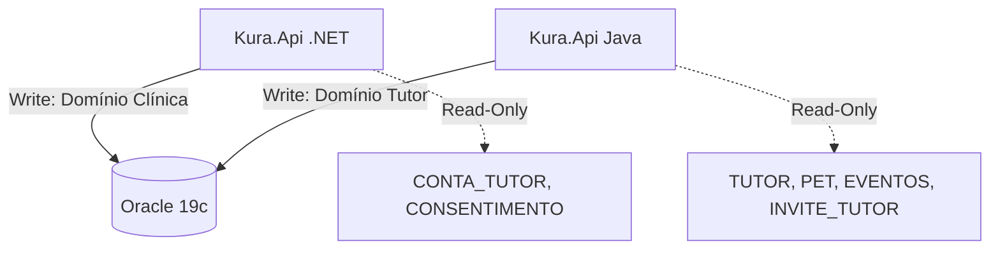

# KURA — Banco de Dados

<p align="center">
  
  
  
  
  
  
</p>

Repositório central de modelagem, scripts DDL e versionamento do banco de dados relacional do sistema de gestão veterinária **Clyvo Vet** (KURA). Desenvolvido como parte do Challenge FIAP 2026, disciplina **Mastering Relational and Non-Relational Database**.

---

## Stack

| Tecnologia | Versão | Finalidade |
|---|---|---|
| Oracle Database | 19c / 21c | SGBD Relacional principal |
| Flyway | 10.x | Versionamento de schema e migrations |
| SQL Developer Data Modeler | — | Modelagem lógica (Notação Barker) |
| PlantUML | — | Geração de diagramas de classes e DER |

---

## Arquitetura e Ownership

O banco opera no padrão **Shared Database**, servindo a dois backends simultaneamente com regras estritas de *ownership* (propriedade de escrita) para evitar acoplamento nocivo e concorrência descontrolada.



| Domínio | Responsabilidade | Ownership (Escrita) |
| --- | --- | --- |
| **Clínica (.NET)** | Operação base, prontuário, IoT e convites | `CLINICA`, `VETERINARIO`, `TUTOR`, `PET`, `EVENTO_CLINICO`, `DISPOSITIVO_IOT`, `INVITE_TUTOR` e demais |
| **Tutor (Java)** | Identidade, agendamento e compliance LGPD | `CONTA_TUTOR`, `CONSENTIMENTO`, `AGENDAMENTO`*, `IDEMPOTENCY_KEY` |
| **Compartilhado** | Auditoria e relatórios agregados | `LOG_ERRO`, `VW_TIMELINE_PET`, `VW_VACINAS_VENCENDO` |

*A tabela `AGENDAMENTO` utiliza Optimistic Locking (`NR_VERSION`) para permitir fluxos seguros de atualização cruzada.*

---

## Entregas do Challenge (Sprints 1 e 2)

Esta seção mapeia cada arquivo `.sql` do repositório ao requisito avaliativo correspondente da disciplina. Pontuação total disponível: **90 pontos**.

### DDL e Modelagem — `kura_schema_v5.sql`

> **Rubrica:** Modelagem (10 pts)

O arquivo principal de schema (versão 5, definitiva para entrega) contempla:

- **26 tabelas** em **3ª Forma Normal (3FN)**: sem dependências transitivas, sem campos multivalorados, todas as dependências parciais eliminadas via tabelas de lookup (`ESPECIE`, `RACA`, `TIPO_EVENTO`, `MEDICAMENTO`).
- **22 sequences** Oracle com `NOCACHE NOCYCLE`.
- **3 views** pré-computadas: `VW_TIMELINE_PET`, `VW_VACINAS_VENCENDO`.
- Estratégia de PK diferenciada por domínio:
  - Tabelas .NET → `DEFAULT SEQ_xxx.NEXTVAL`
  - Tabelas Java → `GENERATED BY DEFAULT AS IDENTITY` (compatível com `GenerationType.IDENTITY` do JPA/Hibernate 6)
  - `AGENDAMENTO` → `SEQ_AGENDAMENTO` (compatível com `GenerationType.SEQUENCE` do Java)
- `COMMENT ON TABLE` e `COMMENT ON COLUMN` em todas as entidades — documentação nativa no SGBD.
- `LOG_ERRO` sem FKs intencionalmente: um registro de auditoria jamais pode falhar por violação referencial.

### REQ 1 — Procedures de Carga Parametrizadas — `kura_req1_procedures_carga.sql`

> **Rubrica:** 20 pts

Cinco stored procedures criadas, todas sem nenhum valor hard-coded:

| Procedure | Tabela-Alvo | Exceções Específicas |
|---|---|---|
| `PRC_INSERT_CLINICA` | `CLINICA` | `DUP_VAL_ON_INDEX` (CNPJ/e-mail), `VALUE_ERROR` |
| `PRC_INSERT_ESPECIE` | `ESPECIE` | `DUP_VAL_ON_INDEX` (nome duplicado), `VALUE_ERROR` |
| `PRC_INSERT_VETERINARIO` | `VETERINARIO` | `DUP_VAL_ON_INDEX` (CRMV), `NO_DATA_FOUND` |
| `PRC_INSERT_TUTOR` | `TUTOR` | `DUP_VAL_ON_INDEX` (CPF/e-mail), `VALUE_ERROR` |
| `PRC_INSERT_PET` | `PET` | `NO_DATA_FOUND` (tutor/espécie inválidos), `VALUE_ERROR` |

Todas atendem integralmente à rubrica:
- ✅ Parâmetros formais tipados com `%TYPE` (zero hard-code)
- ✅ `EXCEPTION WHEN OTHERS` em todos os blocos
- ✅ Mínimo de 2 exceções específicas por procedure
- ✅ Log de erro gravado em `LOG_ERRO` com: `NM_PROCEDURE`, `USER`, `SYSTIMESTAMP`, `SQLCODE`, `SQLERRM` e parâmetros da chamada

O arquivo inclui ainda um **bloco anônimo de carga de demonstração** que invoca todas as procedures em sequência, populando o banco com dados realistas para execução dos requisitos subsequentes.

### REQ 2 — Blocos Anônimos com JOINs — `kura_req2_consultas_joins.sql`

> **Rubrica:** 20 pts

Dois blocos anônimos PL/SQL com consultas complexas via cursor:

| Bloco | Tabelas Unidas (JOINs) | Agrupamento | Ordenação | Saída |
|---|---|---|---|---|
| **A** | `PET` ⟶ `ESPECIE` ⟶ `CLINICA` | Por clínica e espécie | Clínica ASC, total DESC | Distribuição de pets por espécie (com breakdown M/F e porte P/M/G) |
| **B** | `AGENDAMENTO` ⟶ `VETERINARIO` ⟶ `CLINICA` | Por status e veterinário | Clínica ASC, total DESC | Resumo de agendamentos com breakdown por status |

Ambos os blocos produzem relatórios formatados via `DBMS_OUTPUT` com cabeçalhos, separadores e total geral.

### REQ 3 — Relatório Analítico LAG/LEAD — `kura_req3_analitico_lag_lead.sql`

> **Rubrica:** 20 pts

Bloco analítico sobre a tabela `LEITURA_TEMPERATURA` (time-series dos sensores IoT):

- **`LAG(VL_TEMPERATURA, 1, NULL)`** → temperatura da leitura *anterior*
- **`LEAD(VL_TEMPERATURA, 1, NULL)`** → temperatura da *próxima* leitura
- Particionamento por `ID_DISPOSITIVO_IOT`, ordenado por `DT_LEITURA` (série temporal correta)
- Valores `NULL` (primeira e última linha da série) impressos como `"Vazio"` conforme especificação da rubrica
- Bloco de carga de demonstração incluso: insere 1 dispositivo IoT (`ESP32-KURA-01`) e **7 leituras** espaçadas em 1 minuto — garantindo ≥ 5 linhas com valores anterior **e** próximo preenchidos

### REQ 4 — Cursores Explícitos com IF/CASE — `kura_req4_cursores_relatorios.sql`

> **Rubrica:** 20 pts

Quatro blocos anônimos, cada um com cursor explícito (`OPEN` / `FETCH` / `EXIT WHEN %NOTFOUND` / `CLOSE`) e estrutura de tomada de decisão:

| Bloco | Tabelas | Tomada de Decisão | Destaque |
|---|---|---|---|
| **I** | `CLINICA` · `VETERINARIO` | `IF` — classifica clínica pelo volume de vets | **Sub-Total por clínica + Total Geral** *(rubrica obrigatória)* |
| **II** | `PET` · `ESPECIE` · `CLINICA` | `IF` cascata — fase de vida + prioridade preventiva | Porte e faixa etária cruzados |
| **III** | `AGENDAMENTO` · `VETERINARIO` · `CLINICA` | `CASE` — ação recomendada por status | Criticidade de agendamentos |
| **IV** | `LEITURA_TEMPERATURA` · `DISPOSITIVO_IOT` | `IF` cascata — faixa de temperatura | Alertas de sensor IoT |

---

## Instruções de Execução (How-to para o Avaliador)

### Pré-requisitos

- Conexão ao Oracle 19c com as credenciais do squad (veja seção [Conexão com o Banco](#conexão-com-o-banco-ambiente-fiap))
- `SERVEROUTPUT` habilitado para visualizar a saída dos blocos PL/SQL

### Passo a Passo

Execute os scripts **na ordem exata abaixo** usando SQL Developer, DBeaver ou DataGrip:

```sql
-- Passo 0 — habilitar saída dos blocos PL/SQL
SET SERVEROUTPUT ON SIZE UNLIMITED;

-- Passo 1 — criar a estrutura completa do banco (sequences, tabelas, views)
@src/kura_schema_v5.sql

-- Passo 2 — criar as procedures e carregar os dados de demonstração
@src/kura_req1_procedures_carga.sql

-- Passo 3 — executar as consultas com JOIN, GROUP BY e ORDER BY
@src/kura_req2_consultas_joins.sql

-- Passo 4 — carregar série temporal IoT e executar relatório LAG/LEAD
@src/kura_req3_analitico_lag_lead.sql

-- Passo 5 — executar os quatro blocos com cursores explícitos
@src/kura_req4_cursores_relatorios.sql
```

> **Nota:** Os scripts dos Passos 3, 4 e 5 podem ser executados em qualquer ordem entre si, desde que o Passo 2 tenha sido concluído com sucesso (dados de demonstração carregados).

**Re-execução:** Para recriar o schema do zero, descomente o bloco de `DROP` no início de `kura_schema_v5.sql` e execute-o antes do Passo 1.

---

## Conexão com o Banco (Ambiente FIAP)

A infraestrutura do banco de dados é fornecida pela FIAP. **Não utilizamos containers Docker locais para o Oracle.**

Para conectar via IDE (DBeaver, DataGrip, SQL Developer), utilize as credenciais do squad:

| Parâmetro | Valor |
| --- | --- |
| **Host** | `oracle.fiap.com.br` |
| **Porta** | `1521` |
| **SID / Service** | `ORCL` |
| **User** | `RMXXXXX` *(credencial do squad)* |
| **Password** | `<senha-fornecida>` |

---

## Estrutura de Diretórios

```text
.
├── docs/
│   ├── adr-migrations-flyway.md       # ADR 001: Flyway + EF Core Migrations (decisão arquitetural)
│   ├── relatorio_banco_de_dados.md    # Relatório técnico completo (Sprints 1 e 2)
│   ├── Relatorio_BancoDeDados_Kura_API.pdf  # Versão PDF do relatório para entrega
│   └── kura-db-docs.html              # Documentação do schema gerada (Data Modeler)
├── src/
│   ├── kura_schema_v5.sql             # ★ DDL definitivo — sequences, tabelas, índices, views
│   ├── kura_schema_v4.sql             # DDL versão anterior (referência histórica)
│   ├── kura_req1_procedures_carga.sql # REQ 1 — 5 procedures + bloco de carga (20 pts)
│   ├── kura_req2_consultas_joins.sql  # REQ 2 — JOINs, GROUP BY, ORDER BY (20 pts)
│   ├── kura_req3_analitico_lag_lead.sql # REQ 3 — LAG/LEAD time-series IoT (20 pts)
│   └── kura_req4_cursores_relatorios.sql # REQ 4 — cursores explícitos + IF/CASE (20 pts)
├── Dockerfile                         # Oracle XE (alternativa local para testes de schema)
├── CLAUDE.md                          # Guia para Claude Code
└── README.md
```

---

## Regras de Versionamento (DDL)

1. **Nunca modifique scripts já aplicados:** O Flyway falha se o checksum de um arquivo já registrado na tabela `flyway_schema_history` for alterado.
2. **Novas alterações:** Crie arquivos sequenciais com nomenclatura exata: `V2__add_tabela_nova.sql`, `V3__altera_coluna.sql`.
3. **Prefixos de coluna obrigatórios:**

| Prefixo | Tipo |
|---|---|
| `ID_` | Chaves Primárias e Estrangeiras |
| `NM_` / `DS_` | Nomes e Descrições (`VARCHAR2`) |
| `DT_` | Datas e Timestamps |
| `ST_` | Status / Flags booleanos |
| `VL_` | Valores numéricos de negócio |
| `NR_` | Números não-PK |

4. **Constraints obrigatoriamente nomeadas:** `PK_`, `FK_`, `UK_`, `CK_` — sem constraints anônimas.
5. **Documentação inline:** Todo `CREATE TABLE` deve ser seguido de `COMMENT ON TABLE` e `COMMENT ON COLUMN` para cada coluna.

### Flyway CLI (execução manual)

```bash
flyway -url="jdbc:oracle:thin:@oracle.fiap.com.br:1521:ORCL" \
       -user="RMXXXXX" \
       -password="<senha>" \
       -locations="filesystem:src/migrations" \
       migrate
```

---

## Equipe — Clyvo Vet

| Membro | RM | Função |
| --- | --- | --- |
| **Felipe Ferrete** *(líder técnico)* | RM562999 | .NET · IoT/IA · Banco de Dados |
| **Nikolas Brisola** | RM564371 | Java · Backend Tutor |
| **Guilherme Sola** | RM563674 | Mobile Tutor · UX |
| **Gustavo Bosak** | RM566315 | Mobile Clínica · QA |
| **Clayton Alves** | RM562285 | DevOps · BD |
