# KURA — Documentação Técnica da Sprint 3
## Mastering Relational and Non-Relational Database — FIAP Challenge 2026

> **Fonte deste arquivo:** exportar para **`banco_kura_doc.pdf`** e entregar no portal FIAP
> junto de **`banco_kura_final.sql`**. As 14 imagens referenciadas como `` já
> estão em `docs/prints/` (capturadas do *Script Output* do SQL Developer); o apêndice §12 mapeia
> cada uma ao sub-bloco de origem.

---

## Capa

| | |
|---|---|
| **Disciplina** | Mastering Relational and Non-Relational Database |
| **Instituição** | FIAP — Challenge 2026 |
| **Turma** | 2TDS_ (2º ano, Análise e Desenvolvimento de Sistemas) |
| **Sistema** | KURA — gestão de continuidade veterinária (cliente: Clyvo Vet) |
| **Entrega** | Sprint 3 — 2 procedimentos, 2 funções, 1 gatilho, estrutura e carga |
| **Data** | 2026-09-__ |

### Integrantes (ordem alfabética)

| Nome completo | RM |
|---|---|
| **[PREENCHER: nome completo]** Clayton Alves | RM562285 |
| Felipe Ferrete Soares Lemes | RM562999 |
| **[PREENCHER: nome completo]** Guilherme Sola | RM563674 |
| **[PREENCHER: nome completo]** Gustavo Bosak | RM566315 |
| **[PREENCHER: nome completo]** Nikolas Brisola | RM564371 |

> ⚠️ **Antes de exportar o PDF:** substituir os 4 `[PREENCHER]` pelos nomes completos. A rubrica
> pede *nomes completos em ordem alfabética* e **zero placeholder** no arquivo final.

---

## Sumário

1. Introdução e escopo da entrega
2. Modelo do banco de dados
3. Função 1 — `FN_COBRANCA_JSON`
4. Procedimento 1 — `PRC_LISTAR_COBRANCAS_JSON`
5. Procedimento 2 — `PRC_RELATORIO_COBRANCAS`
6. Função 2 — `FN_CALCULAR_SCORE_URGENCIA`
7. Gatilho — `TRG_AUDITORIA_COBRANCA` e a tabela `AUDITORIA_COBRANCA`
8. Modelo de tratamento de erros
9. Nota sobre o código da 2ª Sprint
10. Uso de Inteligência Artificial
11. Pré-requisitos e como executar
12. Apêndice — mapa dos prints

---

## 1. Introdução e escopo da entrega

O KURA é um sistema real de gestão de continuidade veterinária, operado por dois backends
independentes (um .NET para a clínica, um Java para o tutor) sobre um **único banco Oracle 19c**
compartilhado. O schema é mantido por **19 migrations Flyway** no repositório `backend-tutor-java`.

O arquivo de entrega **`banco_kura_final.sql`** é a **consolidação dessas 19 migrations num script
único e executável** — cada tabela nasce no estado final, com todas as ~75 alterações posteriores
(`ALTER TABLE`) já aplicadas — **mais** os 5 objetos PL/SQL e a tabela de auditoria exigidos pela
Sprint 3.

### 1.1. O que a Sprint 3 pede e onde está no arquivo

| Item | Pts | Onde |
|---|---|---|
| Procedimento 1 — JOIN ≥ 2 tabelas, saída JSON string por função do grupo, ≥ 3 exceções | 15 | Bloco 9.1 |
| Procedimento 2 — tabela de fatos, soma por combinação + subtotal + total geral, **sem** `ROLLUP`/`CUBE`/`GROUPING`, formato fixo, ≥ 3 exceções | 15 | Bloco 9.2 |
| Função 1 — relacional → JSON string, lógica de conversão do grupo, **sem** built-in de JSON, ≥ 3 exceções | 15 | Bloco 8.1 |
| Função 2 — substitui um processo lógico do projeto, ≥ 3 exceções | 15 | Bloco 8.2 |
| Gatilho — tabela de auditoria (usuário, operação, data/hora, `:OLD`, `:NEW`) + trigger `AFTER INSERT OR UPDATE OR DELETE` | 30 | Blocos 6 e 10 |
| Entrega e documentação (este PDF + o `.sql`) | 10 | — |

### 1.2. A espinha: tudo gira em torno de `COBRANCA`

Os cinco objetos **não são cinco exercícios isolados** — são um recorte do sistema:

- **`FN_COBRANCA_JSON`** serializa uma cobrança em JSON, à mão.
- **`PRC_LISTAR_COBRANCAS_JSON`** consome essa função para expor cobranças (JOIN de 3 tabelas).
- **`TRG_AUDITORIA_COBRANCA`** reusa a **mesma função** para gravar `:OLD`/`:NEW` na trilha de auditoria.
- **`PRC_RELATORIO_COBRANCAS`** agrega a **mesma tabela** que a trigger audita.
- **`FN_CALCULAR_SCORE_URGENCIA`** traz para o banco a regra de urgência que hoje só existe no
  serviço de IA (Luna).

`COBRANCA` foi escolhida como tabela de fatos porque **`VL_COBRADO` é `NUMBER(10,2)` (dinheiro com
2 casas)** — uma soma "manual" precisa parecer uma soma manual, e não um `COUNT(*) × k` — e porque
**`COBRANCA` não tem nenhuma coluna de texto livre**, então auditá-la não cria superfície de
vazamento de dado pessoal (ao contrário de auditar `AGENDAMENTO`, que guarda observação escrita
pelo tutor).

### 1.3. Escopo declarado

- O `.sql` cria **todas as 30 tabelas** do schema no estado da migration V19, **29 sequences**,
  **13 índices**, **2 views** e a tabela `AUDITORIA_COBRANCA` (objeto acadêmico da Sprint 3, que
  **não** vira migration Flyway).
- A carga tem **≥ 5 registros por tabela** (ruling do time). Dados **fictícios**, declarados como
  tais no comentário do bloco 7 (e-mails em domínios reservados `.example`, CPF/CNPJ/telefones
  inventados, hashes com forma de BCrypt mas sem valor).
- O schema Oracle da FIAP é **compartilhado entre disciplinas**; por isso o bloco de limpeza do
  `.sql` derruba **apenas** os objetos do KURA, por nome. A conferência de "todas as tabelas" é
  feita por nome (`WHERE table_name IN (...)`), não por `SELECT COUNT(*) FROM user_tables`.

---

## 2. Modelo do banco de dados

### 2.1. As 30 tabelas (estado da migration V19)

Ordenadas por nível de dependência de chave estrangeira:

| Nível | Tabelas |
|---|---|
| 1 | `CLINICA`, `ESPECIE`, `TIPO_EVENTO`, `MEDICAMENTO`, `LOG_ERRO`, `IDEMPOTENCY_KEY` |
| 2 | `RACA`, `VETERINARIO`, `TUTOR`, `DISPOSITIVO_IOT`, `SERVICO_PRECO` |
| 3 | `PET`, `INVITE_TUTOR`, `CONSENTIMENTO`, `USUARIO_CLINICA`, `LEITURA_TEMPERATURA`, `INTERACAO_CANAL`, `NOTIFICACAO` |
| 4 | `TUTOR_PET`, `CONTA_TUTOR`, `EVENTO_CLINICO`, `ALERTA_TEMPERATURA`, `TRIAGEM_LUNA` |
| 5 | `AGENDAMENTO`, `CONSULTA`, `EXAME`, `VACINA`, `PRESCRICAO`, `DOCUMENTO`, **`COBRANCA`** |

**Estratégia de chave primária (herdada do banco real, não uniformizada):**

- **26 tabelas** usam `DEFAULT SEQ_X.NEXTVAL` (padrão do backend .NET).
- **4 tabelas** usam `GENERATED BY DEFAULT AS IDENTITY` (padrão do backend Java): `CONTA_TUTOR`,
  `CONSENTIMENTO`, `IDEMPOTENCY_KEY` e `AGENDAMENTO`.
- `AGENDAMENTO` é `IDENTITY` no banco **e** puxa de `SEQ_AGENDAMENTO` pela entidade JPA — as duas
  coisas coexistem porque `GENERATED BY DEFAULT` (diferente de `GENERATED ALWAYS`) aceita valor
  explícito. Não é lixo; é a realidade do banco, e está documentada no `.sql`.

### 2.2. O recorte usado pelos 5 objetos

```
                 SERVICO_PRECO ──┐
                                 │ (catálogo de preços)
   CLINICA ──── EVENTO_CLINICO ──┴── COBRANCA ──────────► FN_COBRANCA_JSON  ─► PRC_LISTAR_COBRANCAS_JSON
                                        │  ▲                       │
                                        │  │ (mesma função)        │
                                        ▼  └───────────────────────┘
                              TRG_AUDITORIA_COBRANCA ─► AUDITORIA_COBRANCA
                                        ▲
                              PRC_RELATORIO_COBRANCAS (agrega COBRANCA)

   INTERACAO_CANAL ──► TRIAGEM_LUNA.DS_NIVEL_URGENCIA ◄── FN_CALCULAR_SCORE_URGENCIA
```

### 2.3. Convenções Oracle do projeto

- **Booleanos:** `CHAR(1)` com `'S'`/`'N'` + `CHECK`.
- **Soft delete:** coluna `ST_ATIV*` — `DELETE` físico nunca acontece no produto (a trigger da
  Sprint 3 audita `DELETE` mesmo assim, para a demonstração).
- **Datas:** `TIMESTAMP DEFAULT CURRENT_TIMESTAMP`.

---

## 3. Função 1 — `FN_COBRANCA_JSON`

### 3.1. O que faz

Recebe os **campos escalares de uma cobrança** e devolve uma **string JSON válida**, construída
100% à mão (concatenação + escape próprio). **Não usa** `JSON_OBJECT`, `JSON_ARRAY`, `TO_JSON`,
`JSON_TABLE` nem similar.

### 3.2. Por que existe no KURA

É a peça que o Procedimento 1 consome para expor cobranças e que a Trigger reusa para gravar
`:OLD`/`:NEW`. Ter **um** serializador do grupo, e não três, é o que amarra a entrega numa história
só.

### 3.3. Por que a assinatura é escalar

A trigger `FOR EACH ROW` sobre `COBRANCA` **não pode consultar `COBRANCA`** (`ORA-04091`, tabela
mutante). Por isso a função recebe os 8 valores escalares e só consulta `SERVICO_PRECO` (que a
trigger não toca). Se a assinatura recebesse só `p_id_cobranca` e buscasse o resto por `SELECT`, a
trigger quebraria em runtime — e compilaria normalmente.

### 3.4. Os 4 pontos técnicos

1. **Escape manual, e a ordem importa:** troca-se `\` por `\\` **antes** de `"` por `\"`. Na ordem
   inversa, a barra invertida que o escape da aspa insere seria re-escapada e o JSON sairia
   corrompido.
2. **`NULL` vira o literal `null`, sem aspas** — não string vazia. `ID_SERVICO_PRECO` e
   `DS_FORMA_PAGAMENTO` são nullable, então esse caminho é exercitado de verdade.
3. **Número com ponto decimal forçado:** a sessão da FIAP é pt-BR
   (`NLS_NUMERIC_CHARACTERS = ',.'`), então `TO_CHAR(12.5)` daria `"12,5"` e `{"valor": 12,5}` é
   **JSON inválido**. Força-se `NLS_NUMERIC_CHARACTERS='.,'` no `TO_CHAR`.
4. **Data em formato estável:** `TO_CHAR(p_dt_cobranca, 'YYYY-MM-DD"T"HH24:MI:SS')`, nunca o
   default de `NLS_TIMESTAMP_FORMAT`.

### 3.5. Exceções (3)

| Handler | Quando dispara | O que faz |
|---|---|---|
| `NO_DATA_FOUND` | `p_id_servico` informado mas inexistente em `SERVICO_PRECO` | devolve `{"erro":"NO_DATA_FOUND",...}` |
| `VALUE_ERROR` | estouro do `VARCHAR2` de retorno / conversão inválida | devolve `{"erro":"VALUE_ERROR",...}` |
| `OTHERS` | qualquer outra falha | devolve `{"erro":"OTHERS","sqlcode":...}` |

🔴 O `WHEN OTHERS` é **obrigatório por motivo estrutural**: a trigger chama esta função. Se ela
propagar exceção, derruba o `INSERT`/`UPDATE`/`DELETE` que disparou a trigger. Ela **sempre**
devolve um JSON de fallback, **nunca** propaga. E **não grava em `LOG_ERRO`** — `COMMIT` dentro de
trigger é `ORA-04092`.

### 3.6. Prints

**Print 1 — caminho feliz (escape de aspas e `null`):**

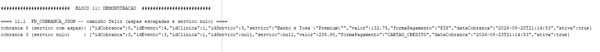

Saída (bloco 11.1):

```
cobranca 8 (servico com aspas): {"idCobranca":8,"idEvento":4,"idClinica":1,"idServico":3,
  "servico":"Banho e Tosa \"Premium\"","valor":132.75,"formaPagamento":"PIX",
  "dataCobranca":"2026-08-28T...","ativa":true}
cobranca 3 (servico nulo)     : {"idCobranca":3,...,"idServico":null,"servico":null,
  "valor":235.90,"formaPagamento":"CARTAO_CREDITO",...}
```

- `\"Premium\"` — aspas escapadas corretamente.
- `"idServico":null,"servico":null` — `NULL` como literal, sem aspas.
- `"valor":132.75` — ponto decimal, apesar da sessão pt-BR.

**Print 2 — exceção tratada:**

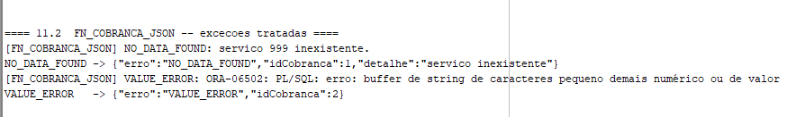

Saída (bloco 11.2):

```
NO_DATA_FOUND -> {"erro":"NO_DATA_FOUND","idCobranca":1,"detalhe":"servico inexistente"}
VALUE_ERROR   -> {"erro":"VALUE_ERROR","idCobranca":2}
```

A função tratou as duas exceções e devolveu JSON de fallback — **não propagou**.

---

## 4. Procedimento 1 — `PRC_LISTAR_COBRANCAS_JSON`

### 4.1. O que faz

Percorre um **cursor explícito com JOIN de 3 tabelas** (`COBRANCA` + `CLINICA` +
`LEFT JOIN SERVICO_PRECO`), chama `FN_COBRANCA_JSON` por linha e imprime **um objeto JSON por
linha** com `DBMS_OUTPUT.PUT_LINE`, agrupado por clínica.

- O `LEFT JOIN` em `SERVICO_PRECO` é proposital — `ID_SERVICO_PRECO` é nullable.
- **Um JSON por linha** porque `DBMS_OUTPUT.PUT_LINE` aborta acima de 32.767 bytes por linha.
- Parâmetro `p_id_clinica` (default `NULL` = todas as clínicas).

### 4.2. Por que 3 tabelas e não 2

A rubrica pede 2 ou mais. `COBRANCA ⟶ CLINICA ⟶ SERVICO_PRECO` é o JOIN que o relatório
financeiro real do sistema usa: cobrança + nome da clínica + nome do serviço.

### 4.3. Exceções (3)

`NO_DATA_FOUND` (clínica do filtro inexistente/inativa, ou nenhuma cobrança), `VALUE_ERROR`,
`OTHERS`. Padrão de tratamento herdado da 2ª Sprint (`banco/kura_req1`):
`ROLLBACK` → `INSERT INTO LOG_ERRO` → `COMMIT` → `DBMS_OUTPUT`. Como é chamada **direta** (transação
própria), pode gravar em `LOG_ERRO` — ao contrário de `FN_COBRANCA_JSON`, que a trigger chama.

### 4.4. Prints

**Print 3 — saída JSON:**

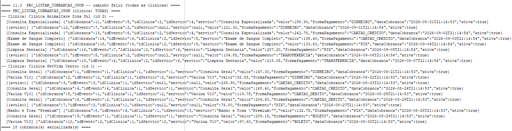

Saída (bloco 11.3, resumo): 18 objetos JSON, agrupados por `-- Clinica: <nome> --`, cada linha
prefixada pelo nome do serviço (`[Consulta Geral]`, `[(avulso)]` quando `ID_SERVICO_PRECO` é nulo).

**Print 4 — exceção tratada:**

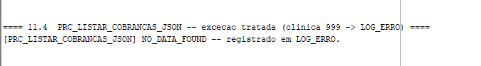

Saída (bloco 11.4):

```
[PRC_LISTAR_COBRANCAS_JSON] NO_DATA_FOUND -- registrado em LOG_ERRO.
```

---

## 5. Procedimento 2 — `PRC_RELATORIO_COBRANCAS`

### 5.1. O que faz

Lê a tabela de fatos `COBRANCA` e imprime um relatório totalizado com **três níveis**:

1. **soma por combinação completa** das categóricas (`ID_CLINICA`, `DS_FORMA_PAGAMENTO`);
2. **`Sub Total`** por grupo da 1ª categoria (`ID_CLINICA`);
3. **`Total Geral`** ao final.

### 5.2. Soma 100% manual

O cursor traz **linhas de detalhe** (cada `COBRANCA`), **sem `GROUP BY`, sem `SUM()`, sem nenhuma
função de agregação, e sem `ROLLUP`/`CUBE`/`GROUPING SETS`/`GROUPING`** (proibidos pela rubrica).
Toda a totalização é feita em **3 acumuladores PL/SQL** (`v_soma_comb`, `v_sub_clinica`,
`v_total_geral`), por **quebra de grupo**.

### 5.3. As duas quebras de grupo e o último grupo

- Ao mudar `DS_FORMA_PAGAMENTO` (ou `ID_CLINICA`): emite a linha da combinação acumulada.
- Ao mudar `ID_CLINICA`: emite a linha `Sub Total` da clínica anterior.
- 🔴 **O último grupo é emitido fora do loop** — não existe próxima iteração para detectar a quebra
  da última combinação / do último subtotal. Depois do `LOOP`, emitem-se a última combinação, o
  último `Sub Total` e o `Total Geral`.

### 5.4. Formato de saída fixo

- Larguras fixas, **ASCII puro** (nada de caixas, blocos ou caracteres de desenho, que viram
  mojibake em print).
- A **coluna numérica termina no mesmo offset de caractere** nas três formas de linha (detalhe,
  `Sub Total`, `Total Geral`).
- Nas linhas `Sub Total` / `Total Geral`, as colunas categóricas ficam **literalmente vazias** —
  o texto `Sub Total`/`Total Geral` é um rótulo, não há valor de agrupamento.

### 5.5. Exceções (3)

`NO_DATA_FOUND`, `VALUE_ERROR`, `OTHERS`. Mesmo padrão `kura_req1` do Procedimento 1.

### 5.6. Prints

**Print 5 — a saída no formato exigido:**

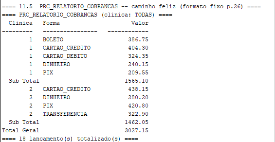

Saída (bloco 11.5):

```
  Clinica   Forma                     Valor
---------   ----------------   ------------
        1   BOLETO                   386.75
        1   CARTAO_CREDITO           404.30
        1   CARTAO_DEBITO            324.35
        1   DINHEIRO                 240.15
        1   PIX                      209.55
  Sub Total                         1565.10
        2   CARTAO_CREDITO           438.15
        2   DINHEIRO                 280.20
        2   PIX                      420.80
        2   TRANSFERENCIA            322.90
  Sub Total                         1462.05
Total Geral                         3027.15
```

Conferência aritmética por fora (um `SELECT` com `SUM`/`GROUP BY`, **não** incluído no `.sql` de
entrega): os subtotais e o total geral batem exatamente.

**Print 6 — exceção tratada:**

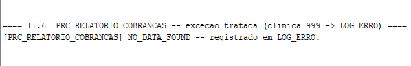

Saída (bloco 11.6): `[PRC_RELATORIO_COBRANCAS] NO_DATA_FOUND -- registrado em LOG_ERRO.`

---

## 6. Função 2 — `FN_CALCULAR_SCORE_URGENCIA`

### 6.1. Que processo do projeto ela substitui

O **motor de triagem léxico da Luna**, que roda hoje em produção:
`kura-luna-ai/luna/src/ai/triage_engine.py` (`TriageEngine.classificar`) +
`luna/src/ai/triage_rules.py` (`TRIAGE_RULES_VERSION = "1.0"`). É o único candidato em que a frase
*"substitui um processo lógico do projeto"* é **verdadeira e ancorável em `arquivo:linha`**. Trazer
a regra para o banco permite reclassificar histórico e classificar na própria carga, sem subir o
serviço Python.

### 6.2. O algoritmo (portado 1:1)

- Pontuação: `ALTA = 10`, `MEDIA = 3`, `BAIXA = 1`.
- 3 níveis, nesta ordem: **ALTA** (5 categorias de sintoma), **MEDIA** (4), **BAIXA** (2).
- O texto é **normalizado** (minúsculas + remoção de acento) — e **as palavras-chave também**, com
  a mesma função. As keywords são escritas já normalizadas no `.sql`.
- Casamento por **substring** (`INSTR > 0`), **sem fronteira de palavra** — igual ao
  `if _normalize(kw) in normalized_text` do Python.
- Cada **categoria** conta **uma vez** por nível (o `break` do Python).
- O **score acumula os pontos de todos os níveis com match** — não só o vencedor: um texto com 1
  categoria ALTA + 1 MEDIA + 1 BAIXA pontua `10 + 3 + 1 = 14`.
- O **nível retornado** é o **primeiro nível** (na ordem ALTA > MEDIA > BAIXA) com qualquer match.
  Sem match nenhum, ou texto vazio/nulo ⇒ `'BAIXA'`.
- O nível calculado é gravado em `TRIAGEM_LUNA.DS_NIVEL_URGENCIA`.

### 6.3. Limites herdados (perguntas de banca)

- **Sem fronteira de palavra:** `"veneno"` é substring de `"venenoso"` → um texto sobre "remédio
  venenoso" classifica como ALTA. Falso positivo herdado do motor original.
- **Sem tratamento de negação:** *"ele **não** está vomitando"* classifica como MEDIA — o `não` é
  ignorado.

Esses limites são **conhecidos e documentados**, não descobertos pelo avaliador. A escolha de um
motor léxico determinístico (em vez de um modelo) é defensável: auditável, explicável, custo zero,
sem risco de alucinação em contexto clínico.

### 6.4. Exceções (3)

| Handler | Quando dispara |
|---|---|
| `e_texto_excede_limite` (exceção do grupo) | texto acima de 4000 caracteres — a *verificação de limites* que a rubrica cita para a Função 2 |
| `VALUE_ERROR` | estouro de buffer / conversão inválida em operação de string |
| `OTHERS` | qualquer outra falha |

Em erro: grava `LOG_ERRO` (chamada direta, não é chamada por trigger) e **retorna `'BAIXA'`** —
degrada para o nível mais baixo, que um humano revisa, já que a coluna destino é `NOT NULL`.

> 🔴 **Como chamar:** porque ela grava DML no tratamento de erro, esta função deve ser chamada
> **de dentro de PL/SQL** (atribuição a variável), **nunca** embutida direto num `SELECT` nem no
> `SET` de um `UPDATE` — ali o Oracle proíbe DML (`ORA-14551`). O bloco de demonstração classifica
> num loop PL/SQL e só então faz o `UPDATE` em `TRIAGEM_LUNA`.

### 6.5. Prints

**Print 7 — os casos de classificação:**

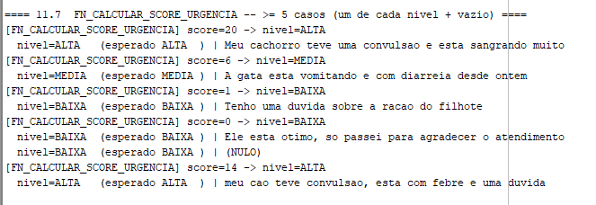

Saída (bloco 11.7):

```
score=20 -> nivel=ALTA   | Meu cachorro teve uma convulsao e esta sangrando muito
score=6  -> nivel=MEDIA  | A gata esta vomitando e com diarreia desde ontem
score=1  -> nivel=BAIXA  | Tenho uma duvida sobre a racao do filhote
score=0  -> nivel=BAIXA  | Ele esta otimo, so passei para agradecer o atendimento
            nivel=BAIXA  | (texto vazio)
score=14 -> nivel=ALTA   | meu cao teve convulsao, esta com febre e uma duvida
```

O último caso demonstra a acumulação: `10 (ALTA) + 3 (MEDIA) + 1 (BAIXA) = 14`, mas o nível
retornado é o mais grave (`ALTA`).

**Equivalência com o motor original:** a função foi validada contra uma reimplementação
independente do `classificar()` usando as palavras-chave literais do `triage_rules.py` — **7/7
casos idênticos**.

**Print 8 — exceção tratada (bloco 11.8):**

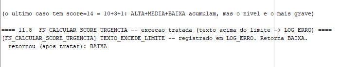

```
[FN_CALCULAR_SCORE_URGENCIA] TEXTO_EXCEDE_LIMITE -- registrado em LOG_ERRO. Retorna BAIXA.
```

**Print 13 — reclassificação de `TRIAGEM_LUNA` (bloco 11.9):**

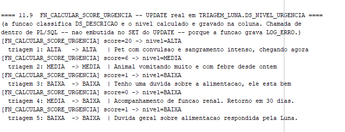

Saída (bloco 11.9):

```
triagem 1: ALTA   -> ALTA   | Pet com convulsao e sangramento intenso, chegando agora
triagem 2: MEDIA  -> MEDIA  | Animal vomitando muito e com febre desde ontem
triagem 3: BAIXA  -> BAIXA  | Tenho uma duvida sobre a alimentacao, ele esta bem
triagem 4: MEDIA  -> BAIXA  | Acompanhamento de funcao renal. Retorno em 30 dias.
triagem 5: BAIXA  -> BAIXA  | Duvida geral sobre alimentacao respondida pela Luna.
```

A triagem 4 foi **reclassificada** (MEDIA → BAIXA) — a descrição não contém nenhuma palavra-chave
do motor.

---

## 7. Gatilho — `TRG_AUDITORIA_COBRANCA` e `AUDITORIA_COBRANCA`

### 7.1. A tabela de auditoria (bloco 6)

```
AUDITORIA_COBRANCA
  ID_AUDITORIA    NUMBER(15)   DEFAULT SEQ_AUDITORIA_COBRANCA.NEXTVAL PRIMARY KEY
  NM_USUARIO      VARCHAR2(60)  NOT NULL   -- USER (nome do usuário do banco)
  DS_OPERACAO     VARCHAR2(10)  NOT NULL   -- INSERT | UPDATE | DELETE  (+ CHECK)
  DT_OPERACAO     TIMESTAMP     DEFAULT SYSTIMESTAMP NOT NULL
  ID_COBRANCA     NUMBER(10)               -- PK do registro afetado (SEM FK, de propósito)
  DS_VALORES_OLD  VARCHAR2(4000)           -- :OLD serializado por FN_COBRANCA_JSON
  DS_VALORES_NEW  VARCHAR2(4000)           -- :NEW serializado por FN_COBRANCA_JSON
```

**Sem FK para `COBRANCA`:** auditoria de `DELETE` com FK ativa seria autocontraditória — a linha
que se quer auditar acabou de deixar de existir. Mesmo raciocínio já usado em `LOG_ERRO`.

### 7.2. A trigger (bloco 10)

Cabeçalho: **`AFTER INSERT OR UPDATE OR DELETE ON COBRANCA FOR EACH ROW`**.

- `INSERTING` / `UPDATING` / `DELETING` definem `DS_OPERACAO`.
- `:OLD` é serializado por `FN_COBRANCA_JSON` **só** quando `UPDATING OR DELETING`;
  `:NEW` **só** quando `INSERTING OR UPDATING`. Logo: **INSERT** → `OLD` nulo; **UPDATE** → os
  dois; **DELETE** → `NEW` nulo.
- A trigger **não tem bloco `EXCEPTION`**: a rubrica exige ≥ 3 exceções em **procedimentos e
  funções**; a trigger não está nessa lista, e um `WHEN OTHERS` mudo aqui **esconderia** falha de
  auditoria, que é o oposto do propósito do objeto. Como `FN_COBRANCA_JSON` já tem `WHEN OTHERS`
  com fallback, um erro de serialização **não** derruba o DML de negócio.

### 7.3. Prints — os três caminhos

**Print 9 — `INSERT` + linha gerada:**

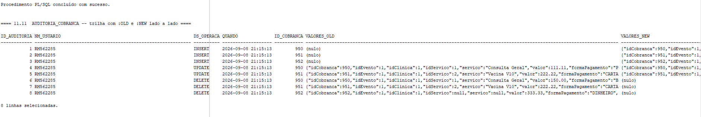

**Print 10 — `UPDATE` com `OLD` e `NEW`:**

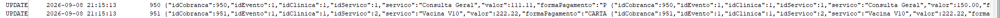

**Print 11 — `DELETE` (a mesma linha de auditoria, mostrando `DS_VALORES_OLD` preenchido e
`DS_VALORES_NEW` nulo):**

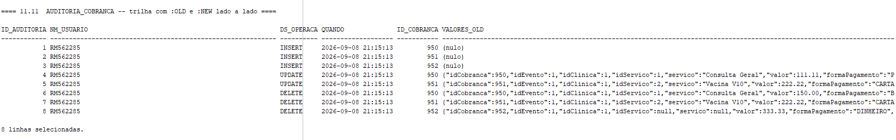

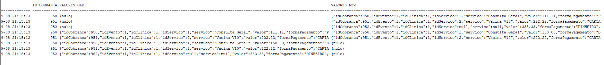

Saída (blocos 11.10 e 11.11) — trilha `AUDITORIA_COBRANCA` após 3 `INSERT` + 2 `UPDATE` +
3 `DELETE` em `COBRANCA`:

| ID | USUARIO | OPERACAO | ID_COBRANCA | DS_VALORES_OLD | DS_VALORES_NEW |
|---|---|---|---|---|---|
| 1 | RM______ | INSERT | 950 | `(nulo)` | `{...,"valor":111.11,...}` |
| 2 | RM______ | INSERT | 951 | `(nulo)` | `{...,"valor":222.22,...}` |
| 3 | RM______ | INSERT | 952 | `(nulo)` | `{...,"servico":null,...}` |
| 4 | RM______ | UPDATE | 950 | `{...111.11...}` | `{...150.00,"BOLETO"...}` |
| 5 | RM______ | UPDATE | 951 | `{...222.22...}` | `{..."ativa":false}` |
| 6 | RM______ | DELETE | 950 | `{...150.00...}` | `(nulo)` |
| 7 | RM______ | DELETE | 951 | `{...222.22...}` | `(nulo)` |
| 8 | RM______ | DELETE | 952 | `{...333.33...}` | `(nulo)` |

**Print 12 — `SELECT` da auditoria + contagem das tabelas:**

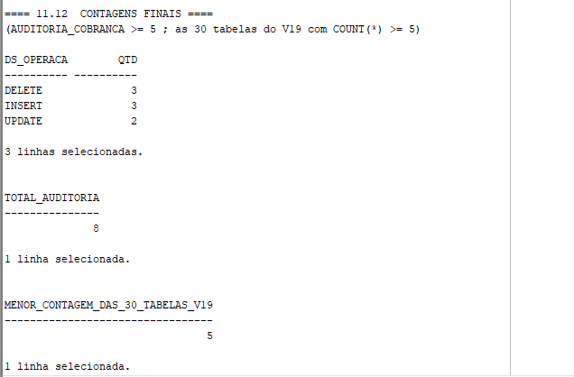

Saída (bloco 11.12):

```
DS_OPERACAO   QTD          TOTAL_AUDITORIA   MENOR_CONTAGEM_DAS_30_TABELAS_V19
DELETE        3            8                 5
INSERT        3
UPDATE        2
```

### 7.4. Prova de que foi a trigger que gravou (mutação)

Com o teste independente `SD-07-teste.sql`: a trigger foi **desabilitada**
(`ALTER TRIGGER TRG_AUDITORIA_COBRANCA DISABLE`), as 3 operações foram repetidas, e
**nenhuma linha** foi gravada em `AUDITORIA_COBRANCA`. Reabilitada, voltou a gravar.

---

## 8. Modelo de tratamento de erros

Padrão herdado da 2ª Sprint (`banco/kura_req1_procedures_carga.sql`): cada handler faz
`ROLLBACK` → `INSERT INTO LOG_ERRO (..., SQLCODE, SQLERRM, DS_PARAMETROS)` → `COMMIT` →
`DBMS_OUTPUT`. Assim o "print de exceção" deixa de ser texto no console e passa a ser **linha
persistida** que dá para consultar.

| Objeto | Exceção 1 | Exceção 2 | Exceção 3 | Grava `LOG_ERRO`? | Demonstrada em |
|---|---|---|---|---|---|
| `FN_COBRANCA_JSON` | `NO_DATA_FOUND` | `VALUE_ERROR` | `OTHERS` | **Não** (chamada por trigger — `COMMIT` em trigger é `ORA-04092`) | bloco 11.2 (`NO_DATA_FOUND`, `VALUE_ERROR`) |
| `PRC_LISTAR_COBRANCAS_JSON` | `NO_DATA_FOUND` | `VALUE_ERROR` | `OTHERS` | Sim | bloco 11.4 (`NO_DATA_FOUND`) |
| `PRC_RELATORIO_COBRANCAS` | `NO_DATA_FOUND` | `VALUE_ERROR` | `OTHERS` | Sim | bloco 11.6 (`NO_DATA_FOUND`) |
| `FN_CALCULAR_SCORE_URGENCIA` | `e_texto_excede_limite` (grupo) | `VALUE_ERROR` | `OTHERS` | Sim | bloco 11.8 (`e_texto_excede_limite`) |

> **`TRG_AUDITORIA_COBRANCA` não entra nesta tabela** — de propósito. Ver §7.2.

**Print 14 (apoio) — as exceções persistidas em `LOG_ERRO`:**

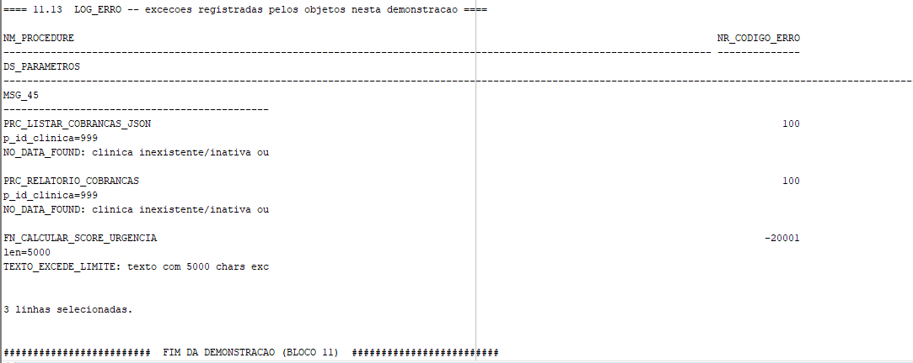

Saída (bloco 11.13): as 3 exceções desta demonstração aparecem em `LOG_ERRO` com
`NM_PROCEDURE`, `NR_CODIGO_ERRO` e `DS_PARAMETROS`.

---

## 9. Nota sobre o código da 2ª Sprint

A rubrica pede *"código da 2ª Sprint corrigido conforme feedback"*. **Não há registro escrito
desse feedback**, então este documento **não alega** correção que ninguém pode conferir — declara
o que foi de fato revisto e por quê:

1. **Consolidação do schema de 26 para 30 tabelas.** O arquivo da Sprint 1/2
   (`kura_schema_final_entrega.sql`) tinha 26 tabelas; o schema real, mantido por 19 migrations
   Flyway, tem **30** (as migrations V15, V17 e V18 acrescentaram `INTERACAO_CANAL`,
   `USUARIO_CLINICA`, `SERVICO_PRECO` e `COBRANCA`). O `.sql` de entrega reflete o estado atual
   (V19), não o de maio.
2. **Tipos alinhados ao banco real.** O arquivo antigo tinha, por exemplo,
   `ST_STATUS VARCHAR2(50)` onde a migration V1 define `VARCHAR2(20)`. Cada uma das 30 tabelas foi
   consolidada conferindo coluna a coluna contra as migrations.
3. **Estratégia de chave primária fiel ao banco.** 26 tabelas com `DEFAULT SEQ_X.NEXTVAL`,
   4 com `IDENTITY` — como está no banco, não uniformizado.
4. **Preenchimento dos RMs na capa.**

---

## 10. Uso de Inteligência Artificial

O grupo usou IA (assistente de código) no processo, e declara honestamente como:

- **Consolidação do schema:** o schema de 30 tabelas veio das 19 migrations Flyway do repositório
  `backend-tutor-java`. A consolidação foi conferida **tabela a tabela contra um mapa escrito
  antes** (`MAPA-CONSOLIDACAO.md`), e depois **validada por execução contra o Oracle real** — não
  por leitura de diff. Uma verificação automática (`SD-02-verificacao.sql`) confirmou 30 tabelas,
  29 sequences, 0 objeto inválido e a contagem de colunas de cada tabela.
- **Os 5 objetos PL/SQL:** cada um foi escrito, **compilado contra o Oracle da FIAP**, e testado
  com um script de teste próprio (`SD-04-teste.sql` … `SD-07-teste.sql`). Bugs de runtime foram
  encontrados e corrigidos por medição: por exemplo, um laço infinito em `FN_CALCULAR_SCORE_URGENCIA`
  (`INSTR` de `NULL` devolve `NULL`, e `EXIT WHEN v_pos = 0` não pega `NULL`) só apareceu ao
  executar, não ao ler.
- **A Função 2:** portada linha a linha do `triage_engine.py`/`triage_rules.py` da Luna, e
  validada contra uma **reimplementação independente** do algoritmo — 7 casos de teste, 7
  idênticos.
- **A trigger:** provada por **mutação** — desabilitada, repetido o DML, confirmado que nada foi
  gravado; reabilitada, voltou a gravar. Não se assumiu que "compilou" significa "funciona".

Nenhum dos 5 objetos foi entregue sem execução contra o banco.

---

## 11. Pré-requisitos e como executar

**Pré-requisitos:** Oracle Database 12c ou superior (a sintaxe `DEFAULT SEQ.NEXTVAL` e
`GENERATED BY DEFAULT AS IDENTITY` exige 12c+; a entrega foi feita no **Oracle 19c** da FIAP).
Cliente: **SQL Developer** (recomendado — evita mojibake por `NLS_LANG` mal configurado).

**Executar:**

1. Abrir `banco_kura_final.sql` no SQL Developer, conectado ao schema de aluno.
2. **Run Script (F5)** — não *Run Statement*.
3. O bloco 0 já faz `SET SERVEROUTPUT ON SIZE UNLIMITED` e `SET LINESIZE 400`.
4. O script é **re-executável**: o bloco 1 (limpeza) derruba, por nome, só os objetos do KURA,
   antes de recriar. Rodar 2× seguidas dá o mesmo resultado.

**O que esperar:** blocos 0–7 (estrutura + carga) rodam com **0 linhas `ORA-`**; blocos 8–10
compilam os 5 objetos sem erro; o bloco 11 (demonstração) exercita os 5 objetos no caminho feliz
**e dispara cada exceção tratada** — as exceções são **tratadas** (não vazam), então a saída do
bloco 11 pode conter a string `ORA-01403` etc. dentro do texto de `SQLERRM` que os handlers
registram: isso é **evidência de que o tratamento de erro funciona**.

---

## 12. Apêndice — mapa dos prints

| Print | Arquivo em `docs/prints/` | Origem no `.sql` |
|---|---|---|
| 1 | `01_fn_cobranca_json_sucesso.png` | bloco 11.1 |
| 2 | `02_fn_cobranca_json_excecoes.png` | bloco 11.2 |
| 3 | `03_prc_listar_cobrancas_json.png` | bloco 11.3 |
| 4 | `04_prc_listar_json_excecao.png` | bloco 11.4 |
| 5 | `05_prc_relatorio_cobrancas.png` | bloco 11.5 |
| 6 | `06_prc_relatorio_excecao.png` | bloco 11.6 |
| 7 | `07_fn_calcular_score_urgencia.png` | bloco 11.7 |
| 8 | `08_fn_score_urgencia_excecao.png` | bloco 11.8 |
| 9 | `09_trigger_insert.png` | bloco 11.10 (INSERT) |
| 10 | `10_trigger_update.png` | bloco 11.10 (UPDATE) |
| 11 | `11_trigger_delete_old.png` + `11_trigger_delete_new.png` | blocos 11.10/11.11 (DELETE) |
| 12 | `12_auditoria_e_contagem.png` | bloco 11.12 |
| 13 | `13_triagem_luna_update.png` | bloco 11.9 |
| 14 | `14_log_erro.png` | bloco 11.13 |

**Como capturar cada print:** cada imagem deve mostrar **o comando e a saída juntos** (não só a
saída). Capturar direto do painel *Script Output* do SQL Developer, com a janela larga o
suficiente para o JSON não quebrar.
